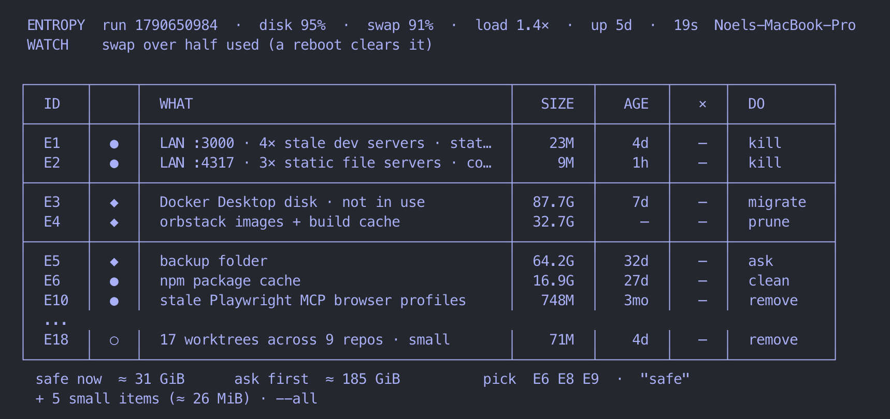

# entropy

Reclaim the machine.



Coding agents start things and walk away. Headless browsers that outlive their session, dev servers from last week, a review broker for every repo you've touched, worktrees nobody remembers, and caches that only ever grow. I had to kill about 200 stray Chrome processes by hand before I went looking.

Entropy is a skill for Claude Code and Codex. It scans a Mac in under 20 seconds, ranks what it finds by what it's costing you, and clears only the rows you pick.

## Install

With Node.js installed:

```bash
npx skills add noeltock/entropy -g
```

Pick your agent in the installer. `-g` makes the skill available across projects. To install for both Claude Code and Codex directly:

```bash
npx skills add noeltock/entropy -g -a claude-code codex
```

Or clone it manually:

```bash
git clone https://github.com/noeltock/entropy.git ~/.claude/skills/entropy
ln -s ~/.claude/skills/entropy ~/.codex/skills/entropy   # Codex, optional
```

## Use

Run `/entropy` in Claude Code or Codex. It shows a table first, then waits for you to pick what goes. Reply with row IDs like `E1 E4`, or `safe` for all the ● and ○ rows. ◆ rows need an explicit ID; held rows stay held.

```
/entropy                  scan, then reply with IDs (E1 E4) or "safe"
/entropy --all            include the small stuff
/entropy --held           show everything it won't touch, and why
/entropy --deep           the slow scans, when you actually want them
/entropy --host <ssh>     same scan on another Mac
```

Installing the skill doesn't run a scan or clean anything. After cleanup, it scans again and shows what's gone and how much disk space changed.

## What it won't do

Touch a worktree with uncommitted or unpushed work, prune Docker volumes, delete a Docker Desktop disk before checking what's inside, kill a browser another session is still using, or act on anything you didn't pick. Caches go through each tool's own clean command, so nothing sits in the Trash pretending to be free space.

## Tuning

Paths and time budgets live at the top of `scripts/entropy.sh` (override any of them with `ENTROPY_*` env vars). A new culprit is one line in `references/culprits.tsv`.

## Evals

`bash evals/run.sh --no-agent` runs the deterministic tests in about 15 seconds, no model needed. Drop `--no-agent` to also run the agent scenarios through `claude -p` against a fake home folder, with every delete swapped for a logger. That part costs tokens. More in [evals/README.md](evals/README.md).

macOS only. It won't beat the second law, but it slows it down.
